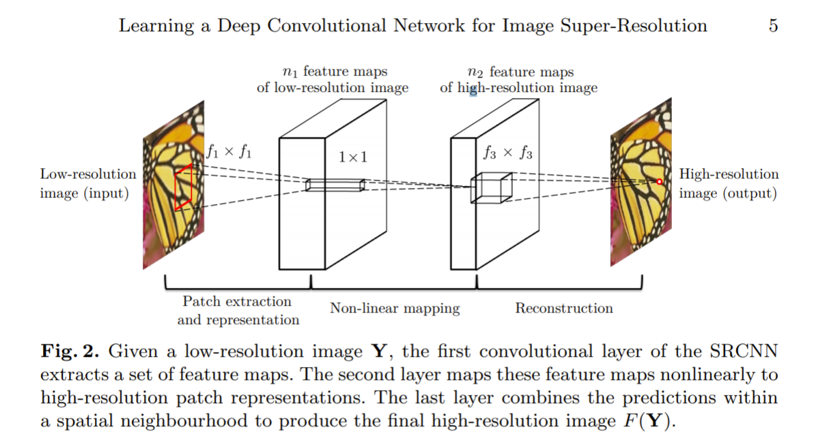
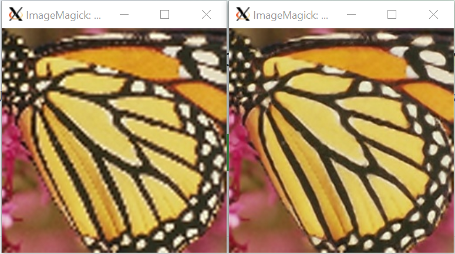

# SRCNN
This repository is a reproduction of work done yb Dong et al on Single Image Super Resolution.

[Image Super-Resolution Using Deep Convolutional Networks](http://mmlab.ie.cuhk.edu.hk/projects/SRCNN.html)

## Datasets
Both train, validation and test sets are avialable in author's website
[Datasets](http://mmlab.ie.cuhk.edu.hk/projects/SRCNN/SRCNN_v1.zip)

## Training

* Attached jupyter notebook was used to train the model. 

* Both, valid and same convolutions were explored for all 3 layers. 

* Two different methods of creating patches were explored, (a.) ordered patches (b.) random patches. Results did not vary much. 

* Modified learning rate -> earlier learning rate of 0.0001 and later increased to 0.003. 

* Training for **400** epochs on training dataset provided by authors did not change PSNR metric much. 

* Explored mean square error as well as psnr as loss metric for model fitting. Both yielded similar results. 

* Data pre-processing pipeline is OpenCV and Numpy based. 

* Used one of the test sets as validation set and another set as test set. In this way, didn't have to partition train data into validation set. 

* Overall training data samples **~22000**.

* Training on GTX 1070 took ~3 hours for 400 epochs.

## Inference

* Inference was tested with batch size = 1.

* PSNR is evidently superior compared to bicubic and bilinear interpolation.

* Additional infrastructure ws developed (./pysrc) in order to reproduce Conv2D and Relu functions with an intention to perform hardware acceleration (ACAP/FPGA).

## References

* https://github.com/MarkPrecursor/SRCNN-keras

* http://mmlab.ie.cuhk.edu.hk/projects/SRCNN.html 
