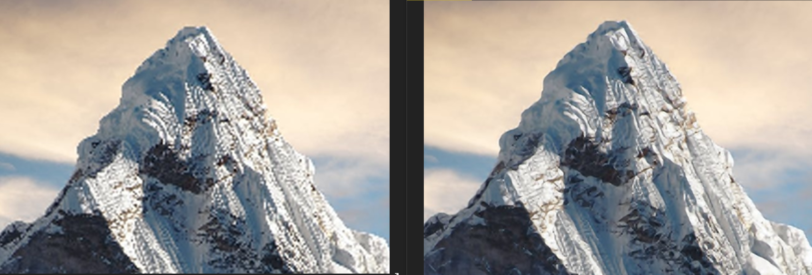

# SRCNN
This repository is a reproduction of work done yb Dong et al on Single Image Super Resolution.

[Image Super-Resolution Using Deep Convolutional Networks](http://mmlab.ie.cuhk.edu.hk/projects/SRCNN.html)


## Toolchain
* python - 3.8.5
* tensorflow - 2.3.0
* cv2 - 4.1.2
* matplotlib - 3.3.2
* numpy - 1.19.2
* Used minconda or conda for virtual environment

## Datasets
Both train, validation and test sets are avialable in author's website
[Datasets](http://mmlab.ie.cuhk.edu.hk/projects/SRCNN/SRCNN_v1.zip)

## Training

* Attached jupyter notebook was used to train the model. 

* Both, valid and same convolutions were explored for all 3 layers. 

* Two different methods of creating patches were explored, (a.) ordered patches (b.) random patches. Results did not vary much. 

* Modified learning rate -> earlier learning rate of 0.0001 and later increased to 0.003. 

* Training for **400** epochs on training dataset provided by authors did not change PSNR metric much. 

### Metrics
Explored **Mean Square Error (MSE)** and **Peak Signal to Noise Ratio (PSNR)** as training metrics.

Training did not show differences usign either of the two metrics. 

### Pre-processing

* Data pre-processing pipeline is OpenCV and Numpy based (check jupyter notebook)

* Used one of the test sets as validation set and another set as test set. In this way, didn't have to partition train data into validation set. 

* Overall training data samples **~22000** from 91 images provided by authors. Imagenet data was not used to train as the literature suggest it is not specifically needed to improvize PSNR.

* Training on GTX 1070 took ~3 hours for 400 epochs.

## Inference

* Inference was tested with batch size = 1.

* PSNR is evidently superior compared to bicubic and bilinear interpolation.

* Additional infrastructure ws developed (./pysrc) in order to reproduce Conv2D and Relu functions with an intention to perform **hardware acceleration (ACAP/FPGA)**.

### Metrics
MSE, PSNR and SSIM(Structural Similarity) was used to evaluate test set. 

Everest - Size (654, 1344)


**This figure shows cubic interpolation vs SRCNN (Tensoflow inteference) vs SRCNN (numpy inference)**

Butterfly - Size (243, 243)


### PSNR Comparision
```bash
***** compare images *****
butterfly_GT.bmp Dimensions: (243, 243)
PSNR cubic: 21.997897  srcnn   : 23.483245  Improvement: 6.752231 percent
PSNR cubic: 21.997897  srcnn_np: 23.483245  Improvement: 6.752231 percent
SSIM cubic: 0.950004  srcnn   : 0.963680  delta: 0.013676
SSIM cubic: 0.950004  srcnn_np: 0.963680  delta: 0.013676
MSE cubic: 410.478772  srcnn   : 291.578723  Delta: -28.966187 percent
MSE cubic: 410.478772  srcnn_np: 291.578723  Delta: -28.966187 percent
***** compare images *****
monarch.bmp Dimensions: (498, 756)
PSNR cubic: 27.328986  srcnn   : 28.330877  Improvement: 3.666039 percent
PSNR cubic: 27.328986  srcnn_np: 28.330877  Improvement: 3.666039 percent
SSIM cubic: 0.965920  srcnn   : 0.972383  delta: 0.006462
SSIM cubic: 0.965920  srcnn_np: 0.972383  delta: 0.006462
MSE cubic: 120.276779  srcnn   : 95.497647  Delta: -20.601759 percent
MSE cubic: 120.276779  srcnn_np: 95.497647  Delta: -20.601759 percent
***** compare images *****
everest.jpg Dimensions: (654, 1344)
PSNR cubic: 25.989811  srcnn   : 26.710072  Improvement: 2.771322 percent
PSNR cubic: 25.989811  srcnn_np: 26.710072  Improvement: 2.771322 percent
SSIM cubic: 0.974010  srcnn   : 0.977776  delta: 0.003766
SSIM cubic: 0.974010  srcnn_np: 0.977776  delta: 0.003766
MSE cubic: 163.719063  srcnn   : 138.698934  Delta: -15.282355 percent
MSE cubic: 163.719063  srcnn_np: 138.698934  Delta: -15.282355 percent
```
## References

* https://github.com/MarkPrecursor/SRCNN-keras

* http://mmlab.ie.cuhk.edu.hk/projects/SRCNN.html 

* https://github.com/yukia18/srcnn-keras 
